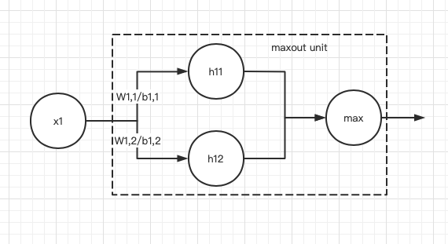

# ReLU and extensions

## ReLU（整流线性单元）

在原点处不可微分问题：不值一提，其实只需要取左逼近或者右逼近中一个就可以了，不用强求二者相等。

## 特性

* ✅    激活状态保持统一的，较大的梯度，避免了梯度爆炸和梯度消失
* ✅    计算速度快
* ❌    无法通过梯度的方法学习使得他们激活为零的样本，即不能对模型参数产生影响。


> 整流操作的二阶导数几乎处处为零，并且在整流线性单元处于激活状时，它的一阶导数处处为1。这意味着相比引入二阶效应的激活函数来说，它的梯度方向对学习来说更加有用。

导数为1且处处相同的好处是，在链式法则的时候，能不失真地，且与unit的值大小无关地传递梯度。

**如果导数不为1：**会导致梯度在传递的时候，增加一个指数项，导致梯度爆炸和梯度消失

**如果导数不处处相同：**会导致梯度传递的大小和unit value的大小有关。比如是激活函数有不等的二阶导数是$$f^{\prime\prime}(x)=x$$，则对于不同的$$x$$, 传递的梯度会不同，导致传递时失真。如果有一层的值非常小，那么传递的时候就会让梯度变得很小，backprop后面的层就更难以感知到梯度变化了。


## 扩展

为了解决无法学习激活为零的样本，产生了几种变种。前三个都是基于在$$z<0$$的情况下给一个非零的斜率$$a$$。

### 1. 绝对值整流（absolute value rectification）：

固定$$a=-1$$ 在图像中对象识别有用到，因为寻找在输入照明极性反转下不变的特征是有意义的。

### 2. 渗漏整流线性单元（Leaky ReLU）:

固定$$a=0.01$$等比较小的数

### 3. 参数化整流线性单元\(parametric ReLU\):

将$$a$$作为学习的参数

### 4. maxout unit:

不仅仅满足于两个区间分段的激活函数，而是多个分段。具体操作如下：

1. 通过学习两个不同的线性单元来计算两个不同的hidden unit
2. 取二者的大值，作为输出

maxout是ReLU的更高层次的泛化。 ReLU就是$$W_{1,1} = 0$$$$b_{1,1} = 0$$,$$W_{1,2} = 1$$$$b_{1,2} = 0$$的情况。

通过增加hidden unit，还可以增加多段线性模型来描述（ReLU只用了两段）。理论上来说，maxout可以以任意精度近似任何凸函数（不断做切线即可）。

maxout的参数是可以学出来的。

